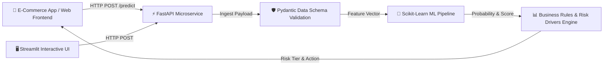

# 🛒 E-Commerce Product Return Risk Engine API

[](https://fastapi.tiangolo.com/)
[](https://www.python.org/)
[](https://scikit-learn.org/)
[](https://streamlit.io/)
[](https://www.docker.com/)
[](https://docs.pytest.org/)

An end-to-end Machine Learning microservice and decision engine that predicts product return probabilities for e-commerce orders in real-time. It validates order payloads, calculates calibrated return risk scores (0–100), tiers orders into actionable risk levels (**Low Risk**, **Medium Risk**, **High Risk**), identifies key risk drivers, and triggers automated business interventions (such as size-fit warnings or exchange incentives).

---

## 🎥 Project Demo

Watch a quick 30-second demonstration of the engine in action:

https://github.com/user-attachments/assets/dec84bc4-5fab-4d8d-b089-8dc47f16f03e

---

## 🏗️ System Architecture



---

## 📂 Repository Layout

```text
ecommerce-return-risk-api/
│
├── models/                         # Serialized ML Pipeline Artifacts
│   ├── model.joblib                # Trained RandomForest Classifier
│   └── pipeline.joblib             # Feature Preprocessing & Scaling Pipeline
│
├── src/                            # Core Application Package
│   ├── __init__.py
│   ├── train.py                    # Dataset loading, cleaning, pipeline fitting & export
│   ├── schemas.py                  # Pydantic data validation schemas & OpenAPI specs
│   └── main.py                     # FastAPI REST API application & prediction endpoints
│
├── tests/                          # Automated Testing Suite
│   ├── __init__.py
│   └── test_api.py                 # Pytest integration tests for FastAPI endpoints
│
├── app.py                          # Interactive Streamlit Web UI Showcase Dashboard
├── Dockerfile                      # Production Docker container setup
├── .dockerignore                   # Docker build exclusions
├── .gitignore                      # Git tracking exclusions
├── requirements.txt                # Python package dependencies
└── README.md                       # Project documentation
```

---

## 🌟 Key Features & Performance

- **Machine Learning Pipeline**: Trained on 5,000 e-commerce order records (`amazon_returns_dataset_cleaned.xlsx`). Uses `ColumnTransformer` with `OneHotEncoder` for categorical attributes (`product_category`, `shipping_type`) and `StandardScaler` for numerical metrics (`price`, `seller_rating`, `customer_tenure_days`, `previous_returns_count`, `quantity`, `discount_applied`).
- **Model Accuracy**: Achieves **88.20% Accuracy** and an **ROC-AUC Score of 0.9458** using a balanced `RandomForestClassifier`.
- **FastAPI Backend**: Real-time REST microservice with automated OpenAPI/Swagger documentation and CORS support.
- **Pydantic Validation**: Strict payload validation (e.g. `price > 0`, `seller_rating` between 1.0 and 5.0, `discount_applied` between 0.0 and 1.0).
- **Streamlit Web Showcase**: Polished interactive dashboard with form controls, progress gauges, color-coded risk badges, and business action triggers.
- **Automated Testing**: 100% passing test suite written with `pytest` and FastAPI `TestClient`.

---

## 🚀 Quick Start Guide

### 1. Environment Setup

Clone the repository and install the dependencies:

```bash
git clone https://github.com/mohdbashyar/ecommerce-return-risk-api.git
cd ecommerce-return-risk-api

# Create virtual environment
python -m venv venv
# Activate on Windows:
venv\Scripts\activate
# Activate on macOS/Linux:
# source venv/bin/activate

# Install dependencies
pip install -r requirements.txt
```

### 2. Train the Model Pipeline

Train the preprocessing pipeline and model classifier, then export serialized joblib artifacts to `models/`:

```bash
python -m src.train
```

### 3. Launch the FastAPI Backend Server

Start the FastAPI application server locally on `http://localhost:8000`:

```bash
uvicorn src.main:app --reload
```

Interactive API Documentation (Swagger UI) is available at:
👉 **[http://localhost:8000/docs](http://localhost:8000/docs)**

---

## 🖥️ Streamlit Web Showcase App

To run the interactive visual dashboard:

```bash
streamlit run app.py
```

Open your browser to `http://localhost:8501` to test predictions interactively with custom sliders, dropdowns, visual gauges, and risk tier badges!

---

## 🔌 API Reference & Usage

### 1. Health Check Endpoint

`GET /health`

**Sample Response:**
```json
{
  "status": "healthy",
  "model_loaded": true,
  "version": "1.0.0"
}
```

### 2. Predict Return Risk Endpoint

`POST /predict`

**Sample cURL Request:**
```bash
curl -X 'POST' \
  'http://localhost:8000/predict' \
  -H 'Content-Type: application/json' \
  -d '{
    "product_category": "Clothing",
    "price": 49.99,
    "seller_rating": 4.2,
    "customer_tenure_days": 120,
    "previous_returns_count": 2,
    "is_prime_member": true,
    "quantity": 1,
    "shipping_type": "Standard",
    "discount_applied": 0.10
  }'
```

**Sample Response Payload:**
```json
{
  "return_probability": 0.7725,
  "risk_score": 77,
  "risk_tier": "High Risk",
  "risk_factors": [
    "High customer previous return history (2 past returns)",
    "Category 'Clothing' has higher baseline size/fit return likelihood"
  ],
  "recommendation": "High Risk: Display size-fit/compatibility warning before checkout and offer instant exchange incentive."
}
```

---

## 🧪 Running Automated Tests

Run the complete Pytest integration test suite:

```bash
pytest tests/ -v
```

---

## 🐳 Docker Deployment

Build and run the production Docker container:

```bash
# Build Docker image
docker build -t ecommerce-return-risk-api .

# Run Docker container
docker run -d -p 8000:8000 --name return-risk-api ecommerce-return-risk-api
```

Test the containerized API health check:
```bash
curl http://localhost:8000/health
```

---

## 📜 License

Distributed under the MIT License. See `LICENSE` for more information.
